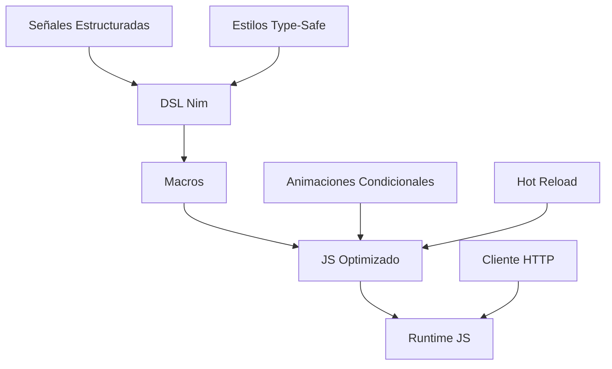
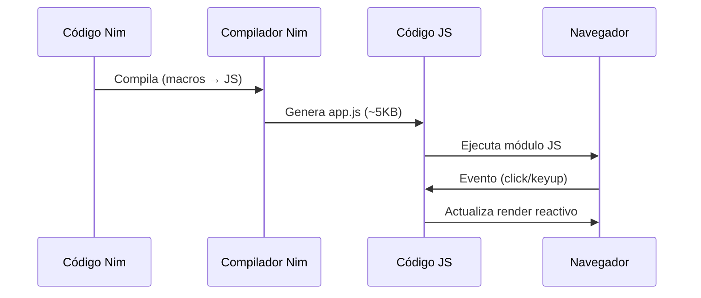

# 🏛️ ¡Explora la Arquitectura de Pikpo en Talpiko Framework!

¡Descubre cómo **Pikpo** construye interfaces rápidas y seguras con **Nim puro**! Su arquitectura compila templates a JS optimizado (~5KB), con reactividad fine-grained y Hot Reload (~50ms), lista para el 12 de julio de 2025 a las 16:02.

## 🚀 Arquitectura General


## 🛠️ Flujo de Compilación
1. **DSL Nim**: Define `template`, `props`, `estado`, `styles`.
2. **Macros**: Validan tipos, eventos, ARIA, y generan JS.
3. **JS Optimizado**: Módulos ligeros con reactividad.
4. **Hot Reload**: Recompila vía WebSocket en ~50ms.

## 🎉 Ejemplo Práctico
Una lista de tareas con cliente HTTP y tipos compartidos:
```nim
import shared.types
template TodoApp:
  props:
    apiUrl: string
  estado:
    todos: seq[Todo] = @[]
  template:
    <div class="container" aria-label="Lista de tareas">
      <h1>Todo App</h1>
      <input bind={nuevoTodo} @keyup.enter={agregarTodo}>
      <ul>
        {for todo in todos:
          <li key={todo.id}>{todo.texto}</li>
        }
      </ul>
    </div>
  métodos:
    proc agregarTodo() {.async.} =
      let todo = await client.postTodo(apiUrl, nuevoTodo)
      todos.add(todo)
```

## 🎨 Flujo de Ejecución


**¡Construye interfaces robustas con Pikpo! 🎨**