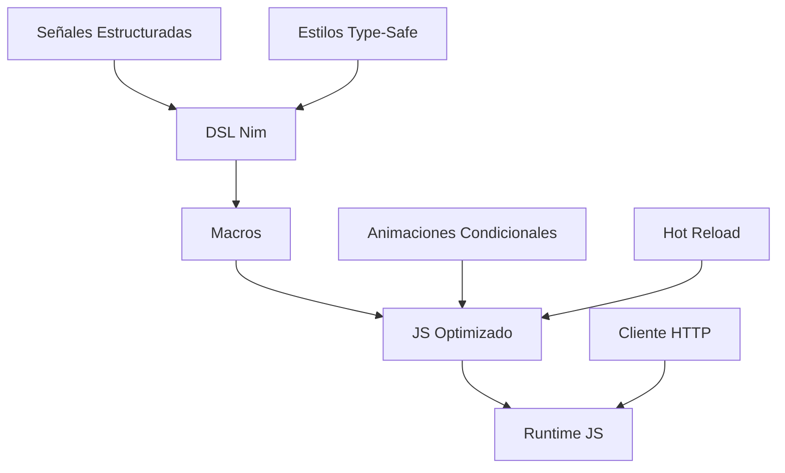

# 🎨 ¡Domina el Frontend con Pikpo en Talpiko Framework!

¡Bienvenido a **Pikpo**, el framework frontend revolucionario de **Talpiko Framework**, impulsado por **Nim puro**! Compila a **JavaScript optimizado** (~5KB), supera a React, Svelte y Vue con reactividad fine-grained, validaciones en compile-time, y Hot Reload ultrarrápido (~50ms). ¡Crea interfaces mágicas el 12 de julio de 2025 a las 16:02!

## 🚀 ¿Qué es Pikpo?
Pikpo es el topo beige creativo que transforma componentes en módulos JS ligeros usando un DSL declarativo. Sus características incluyen:
- **Compilación Modular**: Cada `template` genera un módulo JS independiente.
- **Reactividad Fine-Grained**: Señales estructuradas y stores globales.
- **Sin Dependencias**: Solo Nim y APIs del navegador.
- **Accesibilidad**: Soporte ARIA dinámico (WCAG 2.1).
- **CLI Inteligente**: Comandos como `pikpo gen component`.

## 🏛️ Arquitectura de Pikpo


## 🛠️ Ejemplo Práctico
Una lista de tareas con animación `fadeIn` y cliente HTTP:
```nim
template TodoApp:
  props:
    apiUrl: string
  estado:
    store: Store[TodoState] = createStore(TodoState(todos: @[], nuevoTodo: ""))
  animation:
    const fadeIn = animate"""
      property: opacity
      from: 0
      to: 1
      duration: 300ms
      trigger: onUpdate(store.state.value.todos)
    """
  template:
    <div class="container" aria-label="Lista de tareas">
      <h1>Todo App</h1>
      <input bind={store.state.value.nuevoTodo} @keyup.enter={agregarTodo}>
      <ul>
        {for todo in store.state.value.todos:
          <li key={todo.id}>{todo.texto}</li>
        }
      </ul>
    </div>
  métodos:
    proc agregarTodo() {.async.} =
      let todo = await client.postTodo(apiUrl, store.state.value.nuevoTodo)
      dispatch(store, "add:" & todo.texto)
      dispatch(store, "clear")
```

## 🚀 Ventajas Clave
| Ventaja                  | Explicación                                                                 |
|--------------------------|-----------------------------------------------------------------------------|
| **Props Tipados**        | Validación en compile-time para componentes reutilizables.                  |
| **Reactividad Avanzada** | Señales estructuradas y stores globales para estados complejos.             |
| **Integración con Talpo**| Cliente HTTP y tipos compartidos para fullstack fluido.                     |
| **Rendimiento Nativo**   | JS puro (~5KB) sin Virtual DOM.                                            |
| **CLI Avanzada**         | `pikpo gen component`, `deploy`, `analyze` para DX superior.                |

## 🧱 Estructura de Proyecto
```
pikpo_project/
├── components/          # Componentes reutilizables
│   ├── Button.nim       -> template Button:
├── pages/               # Páginas de la app
│   ├── TodoApp.nim      -> template TodoApp:
├── shared/              # Tipos compartidos
│   ├── types.nim        -> type Todo:
├── styles/              # Estilos escopados
│   ├── global.nim       -> style Global:
├── dist/                # Salida compilada
└── pikpo.toml           # Configuración
```

## 🎨 Un Toque Visual
```
   [DSL] --> [Macros] --> [JS] --> [Render]
      ↓         ↓         ↓         ↓
   [Señales] --> [Cliente HTTP] --> [¡Vivo!]
```

**¡Crea interfaces imbatibles con Pikpo y Talpiko! 🎨**